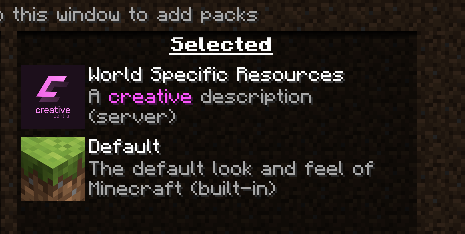

## Custom Resources
`creative-central` lets you add your own resources to the resource-pack, those
resources will be automatically merged with the resources that plugins add.

The resources that you add will be called the **base resource-pack**, since it is
loaded  first, and then plugin resources are added and merged. *(Note that merging
is done by the plugins, not by creative-central)*

### Where is the base resource-pack?
The base resource-pack "lives" in `/plugins/creative-central/resources/`. By default,
you will find two files: `pack.mcmeta` and `pack.png`

### How should I modify it?
The only necessary file is `pack.mcmeta`, here are some tips:
- You **MUST** keep the `pack_format` version in sync with your server's version, you
can find a table [here](https://minecraft.fandom.com/wiki/Pack_format#Resource_Pack)
- You **CAN** update the `description` to whatever you want, it is shown in the
resource-pack selection list
```json
{
    "pack": {
        "description": "<gray>A <light_purple>creative <gray>description",
        "pack_format": 9
    }
}
```
*creative-central also works as a pre-processor, so you can use MiniMessage there,
soon we will support non-strict JSON syntax (supporting comments)*

There is also the `pack.png` file, it is optional and you can replace it by your own
resource-pack icon, the recommended size is 64x64px.

