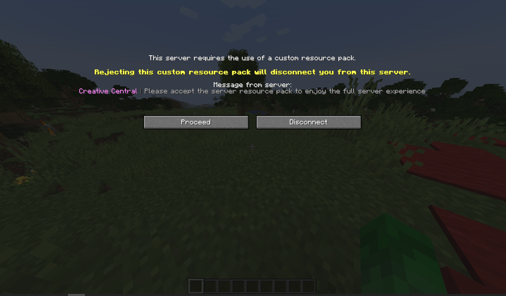

## Resource Pack Prompt
`creative-central` lets you configure **everything**. In this page we are explaining
how to configure the resource-pack prompt. All the settings for the resource-pack
prompt can be found in the `config.yml` file.

This is what the configuration section for it looks like:

```yaml
send:
  request:
    required: true
    prompt: '<#ff8df8>Creative Central <dark_gray>| <gray>Please accept the server resource pack to enjoy the full server experience'
  delay: 0
```

### `required`
The `required` setting tells the Minecraft client whether it is necessary or not to
use the resource-pack to play in your server. *Note that setting this to true
will not necessarily kick the player from the server if they don't download the
resource-pack, to do that, you will have to configure the actions.*

### `prompt`
The resource-pack prompt message, shown in the prompt screen. Supports MiniMessage
format and newlines with `\n`, or using YAML's `|-`
```yaml
send:
  request:
    required: true
    prompt: |-
        Welcome!
        Please accept the resource-pack!
  delay: 0
```

### `delay`
The resource-pack prompt delay, in seconds, determines how much time to wait before
sending the resource pack to the player. Set to zero or less to send immediately.

### And that's it!
Now when you join your server, you should see a screen like this:



And please note that, the Minecraft client will remember the player's choice, so
the screen will appear only once. If you want to be asked again, do the following:
- Go back to the Server List screen
- Select your server and click 'Edit'
- Click the `Server Resource Packs` button until it says 'Server Resource Packs: Prompt'