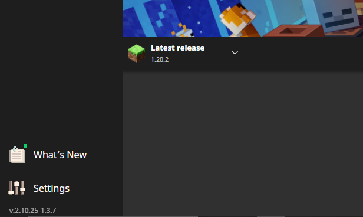
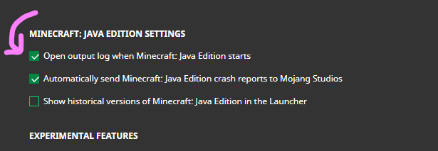
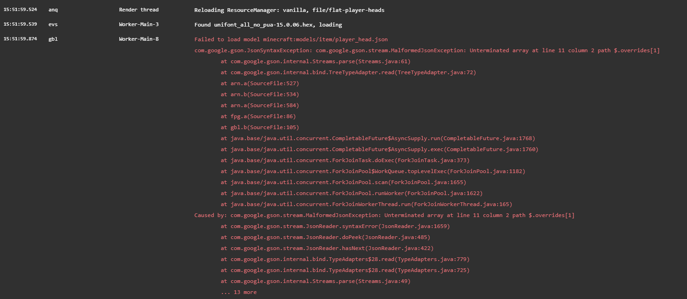

## Reporting Pack Errors

When you join a server that needs a resource-pack, the server asks your client *(your
Minecraft game)* to download it. However, there might errors while downloading a
resource-pack.

In this quick troubleshooting guide, we will check what the error was, so that we can
easily report it to the server administrators *(or to the plugin developers)*.

### Step 1: Open output log
Close the game, re-open the launcher and enable the **"Open output log when Minecraft:
Java Edition starts" setting**. We do this to see the game logs, all the errors should
be visible there.

If you use a launcher other than vanilla launcher, you will have to find a similar setting
and enable it.

- Go to the launcher **Settings** *(Should be in the bottom-left corner)*

- **Check** the **"Open output log when Minecraft: Java Edition starts" setting**

- **Start** the game. When the game starts, there should be another window open,
and should look like this:

### Step 2: Join the server

Now all you have to do is to try joining the server you are having trouble with,
and check the game output window after you get kicked from the server.

There should be some error *(in red text)*, similar to this *example error*:

Don't worry if you don't understand the error, you just have to send it to the
server administrators *(or to the plugin developers)* and they will help you!

### Why do I need to do this?

Sadly, the vanilla Minecraft client doesn't tell the server **why** the resource
packs fail to load, it just tells the server that it **just failed**.